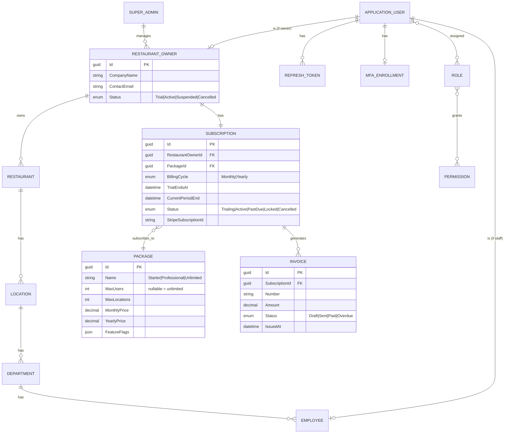
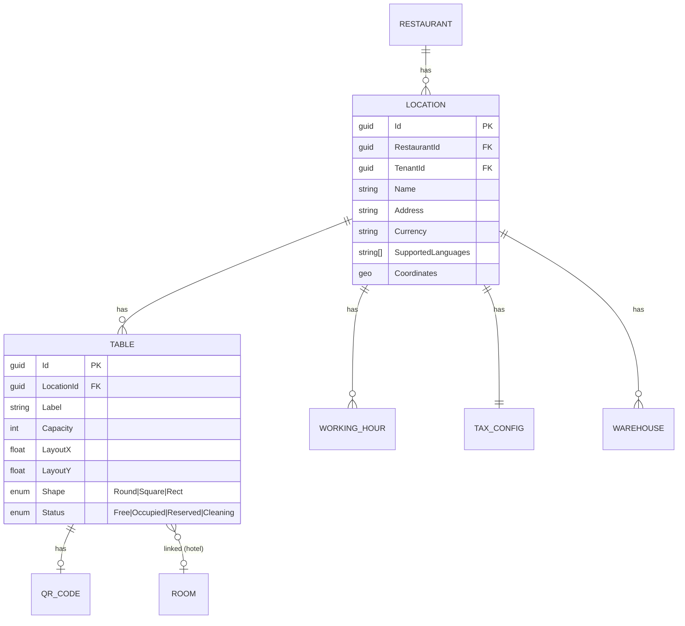
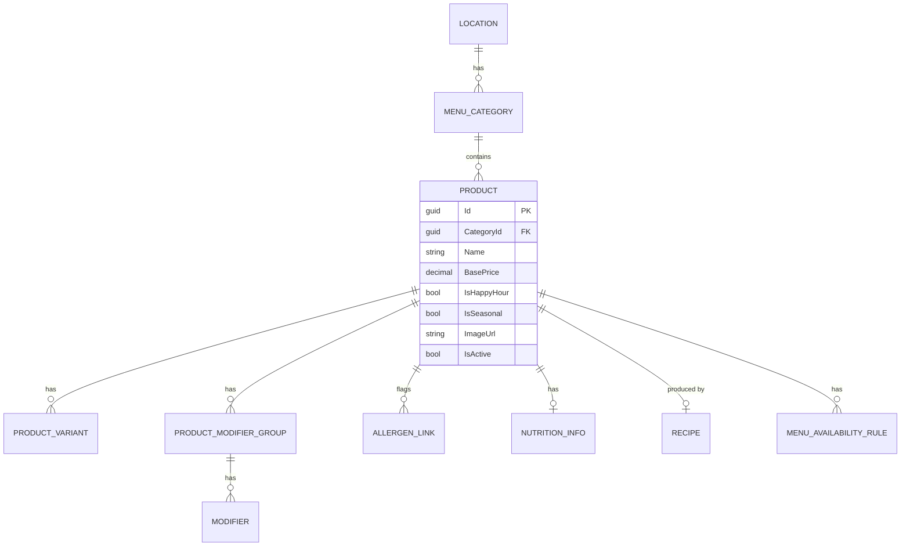
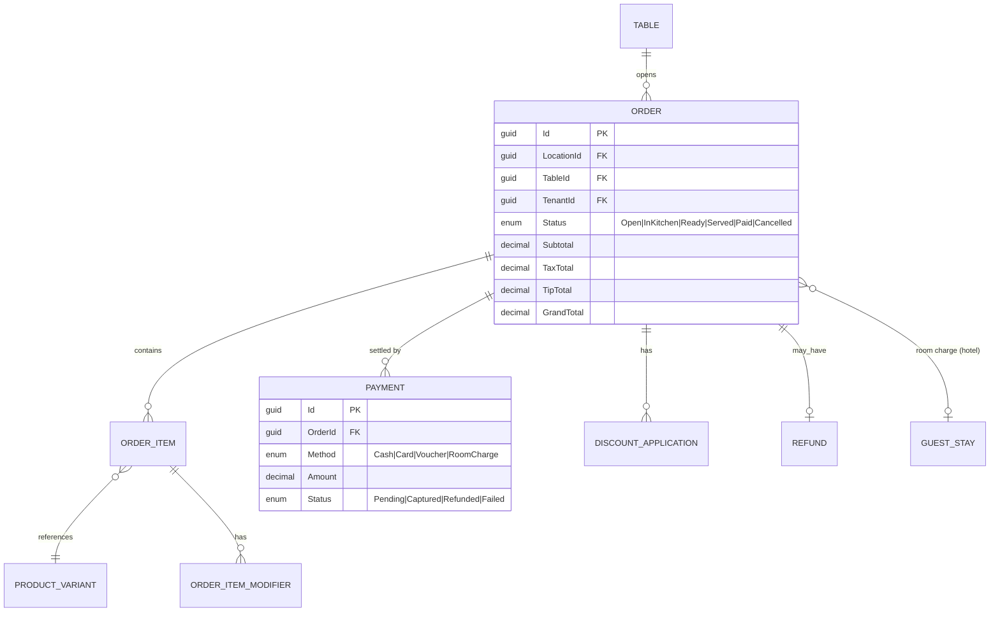
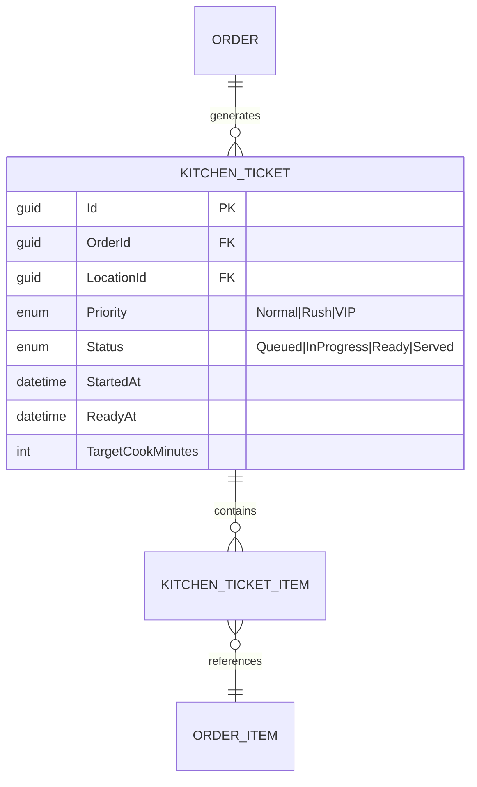
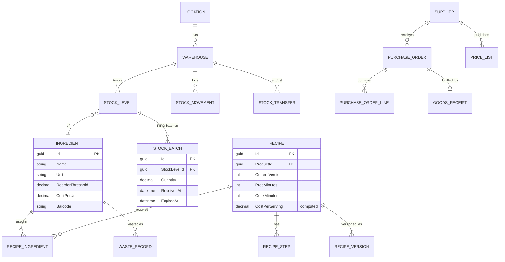
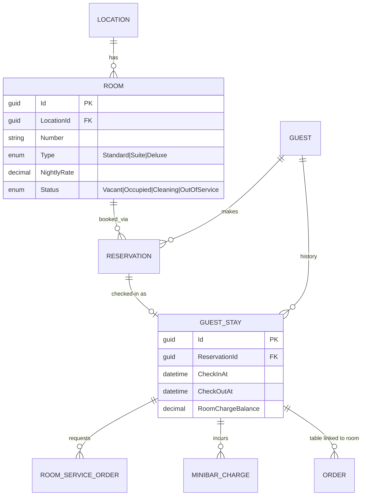
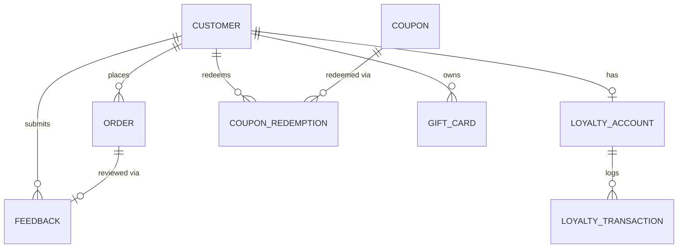
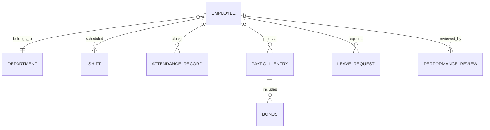
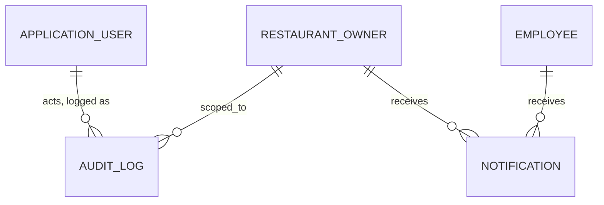

# Entity-Relationship Diagram

Full data model across all 16 modules. Domain entities exist in `RestaurantSaaS.Domain` for every
box below; see [`ROADMAP.md`](ROADMAP.md) for which ones have CQRS/API/UI built on top yet.
Split into sub-diagrams for readability — all sub-diagrams share the same entities.

## 1. Tenancy, Identity, Subscription

## 2. Restaurant, Locations, Tables

## 3. Menu

## 4. POS & Payments

## 5. Kitchen Display

## 6. Inventory, Recipes, Procurement

## 7. Hotel Module

## 8. CRM

## 9. Employees

## 10. Cross-cutting

All tenant-scoped tables (everything below `RESTAURANT_OWNER`) carry a `TenantId` column mapping
to `RestaurantOwnerId`, enforced by the EF Core global query filter described in
[`ARCHITECTURE.md`](ARCHITECTURE.md#multi-tenancy).
